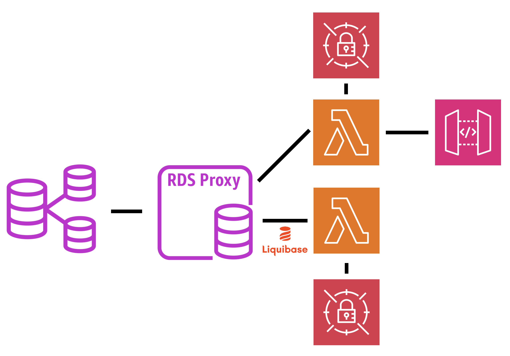
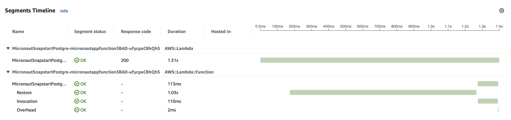

This repository contains a demo of a function developed with [Micronaut Framework](https://micronaut.io) and deployed to [AWS Lambda](https://aws.amazon.com/pm/lambda/).

It connects to a [PostgreSQL](https://www.postgresql.org) database via an [RDS Proxy](https://aws.amazon.com/rds/proxy/). The proxy connects to a Cluster with two read and writer instances.

The Lambda function fetches the credentials to connect to the database from [AWS Secrets Manager](https://aws.amazon.com/secrets-manager/).

The function uses [Liquibase](http://liquibase.org) to manage the database schema. The database schema is created and updated when a dedicated Lambda function [Snapstart](https://docs.aws.amazon.com/lambda/latest/dg/snapstart.html) snapshot is created.

The infrastructure is created, and the functions are deployed with [AWS CDK](https://aws.amazon.com/cdk/).

The architecture is as follows:

The following image shows a trace:

